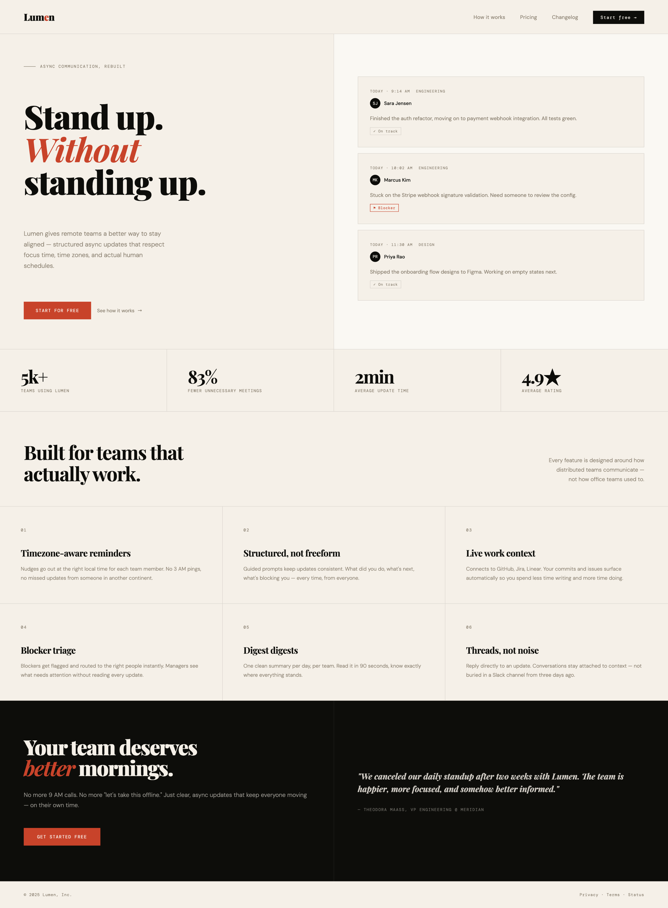
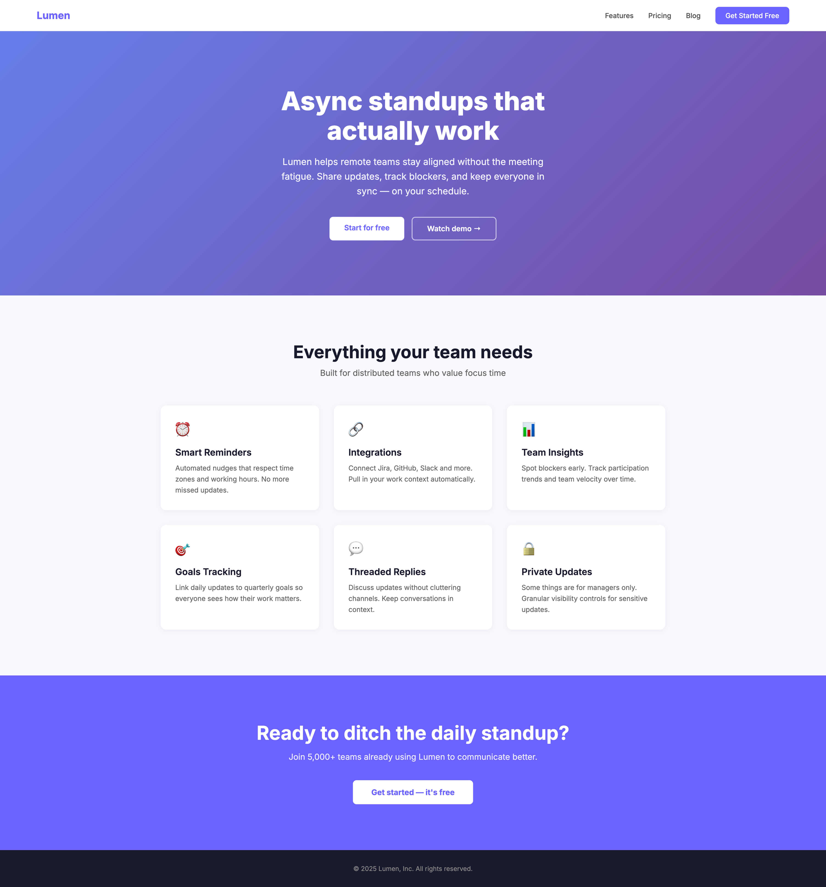
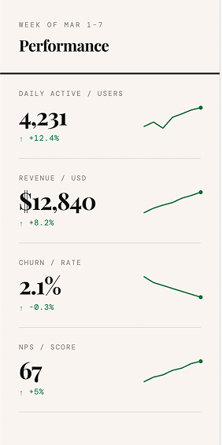
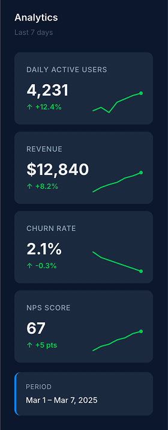
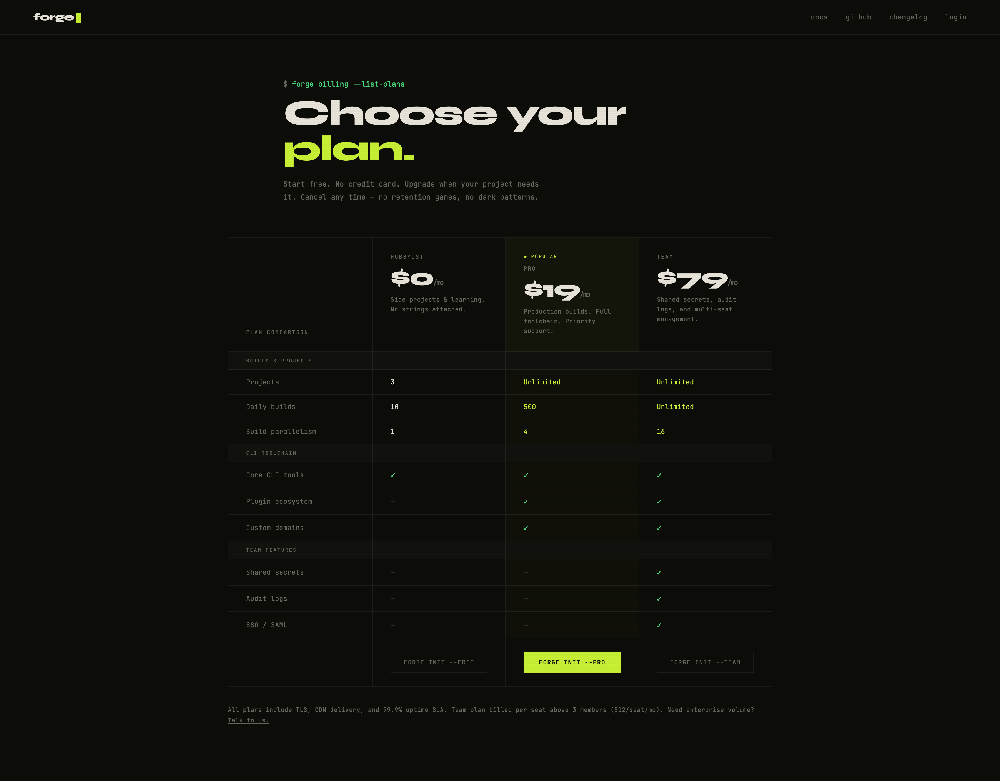
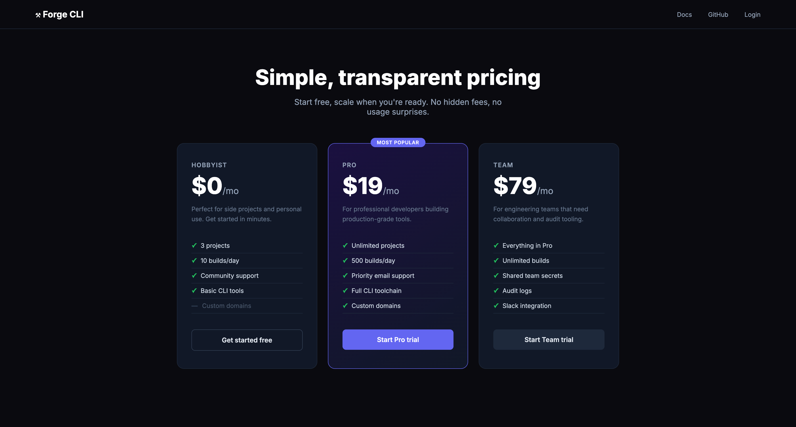

# frontend-design skill benchmark

Benchmark comparing Claude's output quality **with** vs **without** the [`frontend-design`](https://github.com/anthropics/claude-skills) skill loaded.

3 realistic frontend tasks were run under both conditions. Each output was graded against 6 assertions measuring design quality, distinctiveness, and technical craft.

---

## Results

| Eval | With Skill | Without Skill |
|------|:----------:|:-------------:|
| Lumen SaaS landing page | **6/6 (100%)** | 0/6 (0%) |
| Analytics dashboard sidebar | **6/6 (100%)** | 4/6 (67%) |
| Forge CLI pricing page | **6/6 (100%)** | 1/6 (17%) |
| **Overall** | **18/18 (100%)** | **5/18 (28%)** |

**Skill uplift: +72 percentage points**

---

## Assertions

Each eval was graded on 6 assertions:

1. **Avoids generic fonts** — does not use Inter, Roboto, Arial, or system-ui as the primary display font
2. **Avoids purple gradient** — does not use a purple/violet gradient as the hero or primary background
3. **Non-standard layout** — hero/structure is not a simple centered-text block or 3-column card grid
4. **CSS custom properties** — uses `--variables` for color theming
5. **Animations** — includes at least one `@keyframes` animation beyond simple hover transitions
6. **Distinctive aesthetic POV** — has a clear, intentional design direction (editorial, terminal, brutalist, etc.) rather than generic AI output

---

## Eval details

### Eval 0 — Lumen SaaS landing page

**Prompt:** Build a landing page for a SaaS product called 'Lumen' that helps remote teams run better async standups. Include a hero section, features section, and a CTA. Single HTML file, no external dependencies except Google Fonts.

| | With Skill | Without Skill |
|---|---|---|
| |  |  |

| Assertion | With Skill | Without Skill |
|-----------|:----------:|:-------------:|
| Avoids generic fonts | ✅ Playfair Display + DM Sans | ❌ Inter |
| Avoids purple gradient | ✅ Warm paper/ink palette | ❌ `linear-gradient(#667eea, #764ba2)` |
| Non-standard layout | ✅ 2-col editorial grid hero | ❌ Centered text block |
| CSS custom properties | ✅ `--ink`, `--paper`, `--accent`, etc. | ❌ Hardcoded hex values |
| Animations | ✅ `@keyframes fadeUp` with staggered delays | ❌ None |
| Distinctive aesthetic | ✅ Editorial/newspaper register | ❌ Generic SaaS landing |

**With skill:** Editorial aesthetic — Playfair Display serif headlines, ruled-line borders, muted warm paper palette (`#f5f0e8`), DM Mono captions, 2-column split hero with animated standup card previews, numbered feature grid.

**Without skill:** Textbook AI-generated SaaS page — Inter font, purple hero gradient, emoji icons in 3-column feature cards, no CSS variables, no animations.

---

### Eval 1 — Analytics dashboard sidebar

**Prompt:** Create a React component for an analytics dashboard sidebar showing DAU (4,231), Revenue ($12,840), Churn Rate (2.1%), and NPS Score (67). Include sparkline trend indicators and percentage changes. Export as a single JSX file.

| | With Skill | Without Skill |
|---|---|---|
| |  |  |

| Assertion | With Skill | Without Skill |
|-----------|:----------:|:-------------:|
| No external UI libraries | ✅ Pure React + inline styles | ✅ Pure React + inline styles |
| All 4 metrics correct | ✅ | ✅ |
| SVG sparkline | ✅ `<path>` with M/L commands | ✅ `<polyline>` |
| Churn direction correct | ✅ Decrease flagged green | ✅ Decrease flagged green |
| Avoids generic fonts | ✅ Playfair Display + DM Mono | ❌ Inter |
| Distinctive aesthetic | ✅ Warm paper, serif numerals | ❌ Generic dark slate dashboard |

**With skill:** Warm paper background (`#f7f4ef`), Playfair Display for numerals, DM Mono for labels — newspaper/editorial register applied to a data component. No rounded corners. Staggered `fadeIn` animations per metric.

**Without skill:** Functionally correct but visually generic — `#0f172a` dark background, `#1e293b` cards, Inter font, blue-tinted surfaces. Indistinguishable from a thousand AI-generated dashboards. Gets the data right, misses the design brief.

---

### Eval 2 — Forge CLI pricing page

**Prompt:** Design a pricing page in HTML/CSS for a developer tool called 'Forge CLI' with three tiers: Hobbyist ($0/mo), Pro ($19/mo), and Team ($79/mo). Each tier has 4–5 features. Make it feel premium and developer-focused.

| | With Skill | Without Skill |
|---|---|---|
| |  |  |

| Assertion | With Skill | Without Skill |
|-----------|:----------:|:-------------:|
| Correct prices ($0/$19/$79) | ✅ | ✅ |
| Non-standard layout | ✅ Feature comparison table | ❌ 3-card grid |
| Avoids purple accent | ✅ Acid lime (`#c8f135`) | ❌ Indigo (`#6366f1`) |
| Developer-appropriate font | ✅ JetBrains Mono + Syne | ❌ Inter |
| CSS custom properties | ✅ Full `--bg`, `--text`, etc. | ❌ Hardcoded hex values |
| Developer aesthetic | ✅ Terminal UI, CLI commands | ❌ Generic dark SaaS pricing |

**With skill:** Terminal aesthetic — JetBrains Mono throughout, acid lime accent (`#c8f135`), blinking cursor in logo, scanline texture overlay, prompt-style header (`forge billing --list-plans`), CTA buttons styled as CLI commands (`forge init --pro`). Feature comparison table instead of cards.

**Without skill:** Standard dark SaaS pricing — indigo accent (#6366f1), Inter font, 3-column card grid, "Most Popular" badge, no developer-specific visual language.

---

## Analyst observations

- The most reliable signal separating skill from no-skill is **CSS custom properties** — 3/3 with-skill outputs use them, 0/3 without-skill do.
- **Purple/violet** appears as the primary accent in 2/3 baseline outputs (landing hero gradient, pricing card accent). The skill's explicit prohibition is well-targeted.
- **Inter font** appears in 2/3 baselines; the third uses system-ui. With-skill outputs used Playfair Display, DM Mono, JetBrains Mono, and Syne — four different distinctive choices across three evals.
- The **analytics sidebar** is the hardest eval for the baseline (67% pass rate) because functional requirements are easier to satisfy than aesthetic ones. The skill's uplift there is purely in visual design.
- The **pricing page** shows the largest gap (100% vs 17%) — the structural layout choice (table vs cards) alone changes the character of the output completely.
- The skill produces **zero convergence** across outputs — three completely different aesthetics (editorial, newspaper data, terminal). Without the skill, all three outputs trend toward the same generic dark/purple/Inter aesthetic.

---

## Repository structure

```
assets/
  eval-0-with-skill.png             # Lumen landing — with skill screenshot
  eval-0-without-skill.png          # Lumen landing — baseline screenshot
  eval-1-with-skill.png             # Analytics sidebar — with skill screenshot
  eval-1-without-skill.png          # Analytics sidebar — baseline screenshot
  eval-2-with-skill.png             # Forge pricing — with skill screenshot
  eval-2-without-skill.png          # Forge pricing — baseline screenshot

evals/
  evals.json                        # Test prompts and assertion definitions

iteration-1/
  benchmark.json                    # Aggregate results
  eval-0-lumen-landing/
    eval_metadata.json
    with_skill/
      outputs/index.html            # With-skill landing page output
      grading.json
    without_skill/
      outputs/index.html            # Baseline landing page output
      grading.json
  eval-1-analytics-sidebar/
    eval_metadata.json
    with_skill/
      outputs/AnalyticsSidebar.jsx  # With-skill React component
      grading.json
    without_skill/
      outputs/AnalyticsSidebar.jsx  # Baseline React component
      grading.json
  eval-2-forge-pricing/
    eval_metadata.json
    with_skill/
      outputs/index.html            # With-skill pricing page output
      grading.json
    without_skill/
      outputs/index.html            # Baseline pricing page output
      grading.json
```
